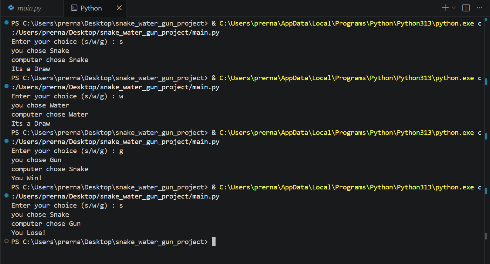

# 🐍 Snake Water Gun Game

A simple command-line Snake Water Gun game developed using Python. In this game, the user plays against the computer, which randomly selects Snake, Water, or Gun. The winner is determined based on predefined game rules.

This project was built to strengthen my understanding of Python fundamentals and improve problem-solving skills.

---

# 📖 About the Project

This is a beginner-friendly Python project created to practice core programming concepts such as dictionaries, conditional statements, user input handling, random module, and input validation.

The project simulates a simple Snake Water Gun game where the computer generates a random choice, and the program decides the winner based on the game rules.

---

# ✨ Features

- Play against the computer
- Random computer choice using `random.choice()`
- Win, Lose, and Draw detection
- Input validation for invalid user input
- Supports both uppercase and lowercase input
- Clean and simple console interface
- Beginner-friendly project

---

# 🛠 Technologies Used

- Python 3
- Random Module

---

# 📚 Python Concepts Used

- Variables
- User Input ('input()')
- Dictionaries
- Conditional Statements ('if', 'elif', 'else')
- Membership Operator ('not in')
- Random Module ('random.choice()')
- String Methods ('lower()')
- Formatted Strings (f-strings)

---

# 🎮 Game Rules

- 🐍 Snake drinks Water.
- 💧 Water damages Gun.
- 🔫 Gun kills Snake.

---

# 📂 Project Structure

```text
snake-water-gun-game-python
│
├── main.py
├── README.md
└── output.png
```

---

# ▶️ How to Run

1. Clone or download this repository.
2. Open the project in Visual Studio Code.
3. Run the following command:

```bash
python main.py
```

4. Enter your choice:

```text
s = Snake
w = Water
g = Gun
```

---

# 📸 Sample Output



---

# 📚 What I Learned

Through this project, I improved my understanding of:

- Python dictionaries
- Conditional statements
- User input handling
- Input validation
- Random module
- Problem-solving using Python
- Writing clean and readable code

---

# 🚀 Future Improvements

- Add a score board
- Play multiple rounds
- Store match history
- Add a Play Again option
- Develop a GUI version using Tkinter
- Add sound effects and animations

---

# 👩‍💻 Author

Prerna Kadam

Computer Engineering Graduate  
Python Learner | Aspiring Backend Developer

---

⭐ If you found this project useful, feel free to star this repository.
